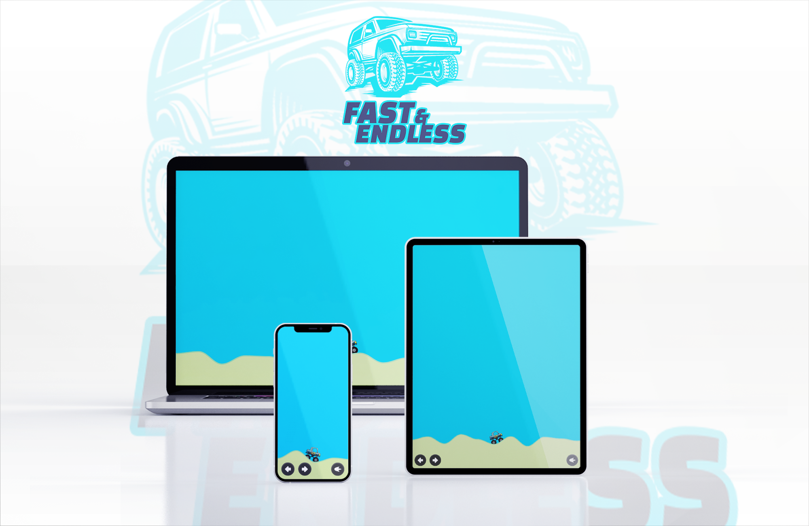
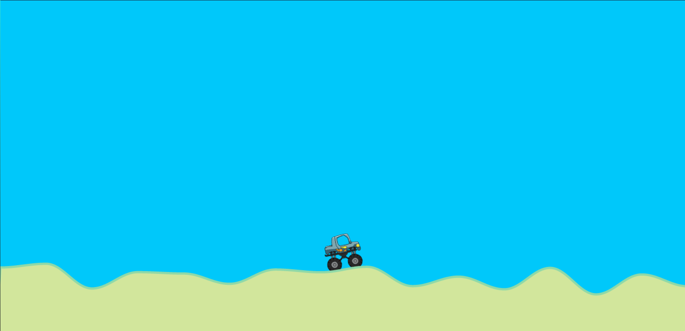
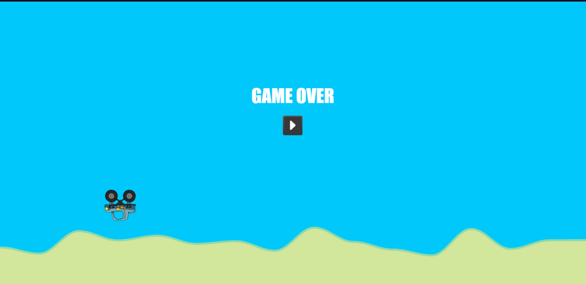
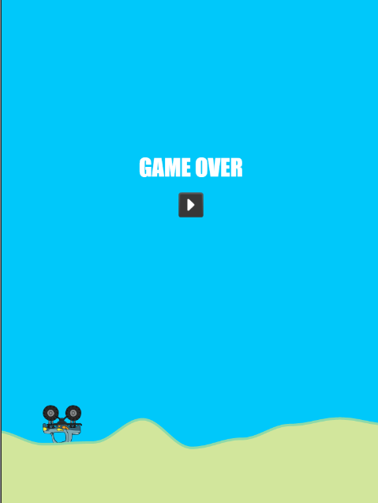
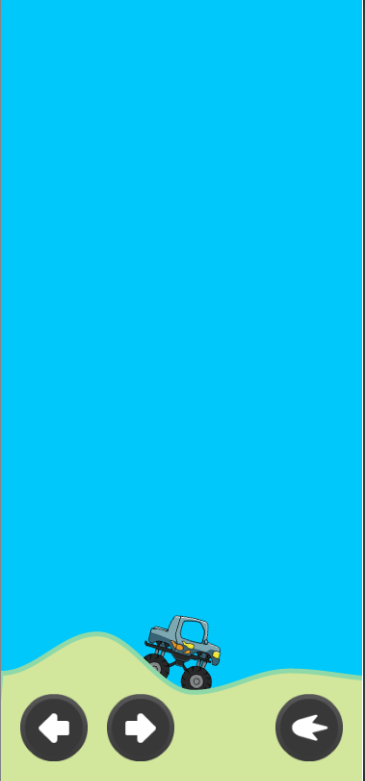

<p align="center"></p>
<p align="center"></p>

- [EN : Description :boom:](#en)  
- [TR : Açıklama :boom:](#tr)


# EN

## Project Details :bomb: 
It's a homework for my Web Based Programming lesson. I created a game with using Javascript. <br>

## Use Tech Stack :anger: 
-HTML <br>
-CSS <br>
-Javascript

## Screenshots from the game :anger: 





,

## How to Setup? :anger:
```sh
git clone https://github.com/alperenorhan/car-game.git
cd car-game
open index.html
```

## How To Play? :anger: 
You can visit to [`website`](https://alperenorhan.github.io/car-game/) of this game to play it!

## Controls :anger: 
Up Arrow : Throttle <br>
Left Arrow : Rotate car to left <br>
Right Arrow : Rotate car to right

## Contact Me! :anger:
You can [click here](https://linktr.ee/alperenorhan.dev) to see all my social links. You can contact me anytime.


# TR

## Proje Detayları :bomb: 
Bu proje okulumun Web Tabanlı Programlama dersinde verilmiş bir ödevdir. Projede, Javascript kullanarak bir oyun yaptım. <br>

## Kullanılan Teknolojiler :anger:
-HTML <br>
-CSS <br>
-Javascript

## Oyundan Ekran Görüntüleri :anger: 


## Projenin Kurulumu :anger:
```sh
git clone https://github.com/alperenorhan/car-game.git
cd car-game
open index.html
```

## Nasıl Oynanır? :anger: 
Oyunu oynamak için [`buraya`](https://alperenorhan.github.io/car-game/) tıklayın!

## Kontroller :anger: 
Yukarı Ok : Gaz <br>
Sol Ok : Aracı sola döndürür <br>
Sağ Ok : Aracı sağa döndürür

## Bana ulaşın! :anger:
Tüm sosyal medya adreslerime [buradan](https://linktr.ee/alperenorhan.dev) ulaşabilirsiniz. Benimle her zaman iletişime geçebilirsiniz.
